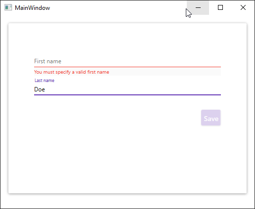

# ReactiveUI Validation Sample
Sample WPF project using ReactiveUI.Validation

* [Basic XAML sample](01-Basic-XAML)  
Sample source code of a WPF application using ReactiveUI.Validation with just XAML. It looks ugly but I want it to keep it simple.

* [Material Design sample](01-Basic-XAML)  
Sample source code of a WPF application using ReactiveUI.Validation and MaterialDesign for better UI.



```csharp
 public class MainViewModel : ReactiveValidationObject<MainViewModel>
    {
        [Reactive] public string FirstName { get; set; }
        [Reactive] public string LastName { get; set; }

        [Reactive] public string SaveResult { get; set; }

        public ReactiveCommand<Unit, Unit> Save { get; }

        public MainViewModel()
        {
            // IsValid extension method returns true when all validations succeed.
            var canSave = this.IsValid();

            Save = ReactiveCommand.Create(() => { SaveResult = $"{LastName.ToUpperInvariant()}, {FirstName}"; }, canSave);

            // Validation rules
            this.ValidationRule(viewModel => viewModel.FirstName,
                firstName => !string.IsNullOrWhiteSpace(firstName), "You must specify a valid first name");

            this.ValidationRule(viewModel => viewModel.FirstName,
                firstName => firstName?.Length >= 5, "First name must have at least five characters");

            this.ValidationRule(viewModel => viewModel.LastName,
                lastName => !string.IsNullOrWhiteSpace(lastName), "You must specify a valid last name");
        }
    }
```

## Notes / Current Issues
* Code behind binding with ReactiveUI this.Bind does not work with WPF. Binding must be done in XAML. Hopefully this will be solved in the future. https://reactivex.slack.com/archives/C02AJB872/p1571739816086600?thread_ts=1571711238.085100